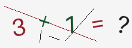
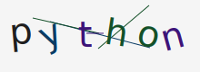

# captchakit

> **Production-ready, async-first captcha library for Python 3.10+.**
> Zero runtime deps beyond Pillow. Drop-in adapters for FastAPI, aiogram, Discord and Django — plus Redis / Postgres storage, rate limiting and Prometheus metrics.

[](https://pypi.org/project/captchakit/)
[](https://pypi.org/project/captchakit/)
[](https://github.com/akerem16/captchakit/actions/workflows/ci.yml)
[](http://mypy-lang.org/)
[](https://github.com/astral-sh/ruff)
[](https://akerem16.github.io/captchakit/stability/)
[](LICENSE)
[](AGENTS.md)

---

## Showcase

Four built-in themes, plus SVG and audio renderers — all produced by the same `CaptchaManager` API.

<table>
  <tr>
    <td align="center"><br><sub><code>Theme.CLASSIC</code></sub></td>
    <td align="center"><br><sub><code>Theme.DARK</code></sub></td>
    <td align="center"><br><sub><code>Theme.PASTEL</code></sub></td>
    <td align="center"><br><sub><code>Theme.HIGH_CONTRAST</code> · WCAG AA</sub></td>
  </tr>
  <tr>
    <td align="center" colspan="2"><br><sub><code>MathChallengeFactory</code> → <code>ImageRenderer</code></sub></td>
    <td align="center" colspan="2"><br><sub><code>WordChallengeFactory</code> → <code>SVGRenderer</code> (~2 KB)</sub></td>
  </tr>
</table>

**Accessibility:** [`accessibility.wav`](docs/assets/showcase/accessibility.wav) — an `AudioRenderer` sample (~110 KB WAV) that dictates the same solution as a visual challenge, so screen-reader users get an a11y-friendly alternative.

> All assets above were rendered by `scripts/render_showcase.py` using the public API — run it yourself to regenerate them.

## Why captchakit

| Feature                       | `lepture/captcha` | `claptcha` | `multicolorcaptcha` | **captchakit**                                 |
| ----------------------------- | ----------------- | ---------- | ------------------- | ---------------------------------------------- |
| Async API                     | ❌                 | ❌          | ❌                   | ✅                                              |
| `py.typed` + mypy strict      | ⚠️                 | ❌          | ❌                   | ✅                                              |
| TTL & attempt tracking        | ❌                 | ❌          | ❌                   | ✅ built-in                                     |
| Pluggable storage             | ❌                 | ❌          | ❌                   | ✅ `Protocol` — Memory / Redis / Postgres       |
| Pluggable rate limiter        | ❌                 | ❌          | ❌                   | ✅ `Protocol` — in-memory & Redis token-bucket  |
| Prometheus metrics            | ❌                 | ❌          | ❌                   | ✅ opt-in                                       |
| Framework adapters            | ❌                 | ❌          | ❌                   | ✅ FastAPI · aiogram · Discord · Django         |
| Audio challenge (a11y)        | ❌                 | ❌          | ❌                   | ✅ `AudioRenderer`                              |
| i18n prompt hooks             | ❌                 | ❌          | ❌                   | ✅ en / tr / de / es + custom catalog           |
| Core runtime deps             | +Pillow           | +Pillow    | +Pillow             | +Pillow                                        |

## Install

```bash
pip install captchakit                  # core

# adapters
pip install "captchakit[fastapi]"
pip install "captchakit[aiogram]"
pip install "captchakit[discord]"
pip install "captchakit[django]"

# storage
pip install "captchakit[redis]"         # + rate-limit token bucket
pip install "captchakit[postgres]"

# observability
pip install "captchakit[metrics]"       # Prometheus adapter
```

## 30-second example

```python
import asyncio
from captchakit import (
    CaptchaManager, ImageRenderer, MemoryStorage, TextChallengeFactory,
)

async def main() -> None:
    manager = CaptchaManager(
        factory=TextChallengeFactory(length=5),
        renderer=ImageRenderer(),
        storage=MemoryStorage(),
        ttl=120.0,
        max_attempts=3,
    )
    challenge_id, png_bytes = await manager.issue()
    # ... show png_bytes to the user, receive their answer ...
    ok = await manager.verify(challenge_id, user_input="ABCDE")
    print("verified" if ok else "wrong answer, more attempts remain")

asyncio.run(main())
```

## FastAPI in 10 lines

```python
from fastapi import Depends, FastAPI
from captchakit import CaptchaManager, ImageRenderer, MathChallengeFactory, MemoryStorage
from captchakit.adapters.fastapi import captcha_router, verify_captcha

manager = CaptchaManager(MathChallengeFactory(), ImageRenderer(), MemoryStorage())
app = FastAPI()
app.include_router(captcha_router(manager, prefix="/captcha"))

@app.post("/register")
async def register(_: None = Depends(verify_captcha(manager))) -> dict[str, bool]:
    return {"ok": True}
```

Run the bundled demo:

```bash
uv run python -m uvicorn examples.fastapi_login:app --reload
# open http://127.0.0.1:8000
```

## Architecture

```
┌──────────────────────────────────────────────────────────────┐
│  Adapters (FastAPI / aiogram / Discord / Django)             │
├──────────────────────────────────────────────────────────────┤
│  CaptchaManager  (issue → render → persist · verify · TTL)   │
├──────────────┬──────────────┬───────────────┬────────────────┤
│  Challenge   │  Renderer    │  Storage      │  Rate limiter  │
│  Text · Math │  Image · SVG │  Memory       │  NoOp          │
│  Grid · Word │  Audio       │  Redis · PG   │  Token bucket  │
└──────────────┴──────────────┴───────────────┴────────────────┘
             ↓ i18n translator · metrics sink · clock
```

Everything coloured here is a `Protocol` — drop in your own implementation without subclassing.

- **Constant-time comparison** via `hmac.compare_digest`.
- **Crypto-safe randomness** via `secrets` for solution generation.
- **CPU-bound Pillow drawing** offloaded to a worker thread with `asyncio.to_thread`.
- **Multi-process safe** when paired with `RedisStorage` or `PostgresStorage`.

## Performance

| Operation                    | Mean (ms) | Median (ms) | p99 (ms) |
|------------------------------|----------:|------------:|---------:|
| `ImageRenderer.render` (PNG) |      3.64 |        3.54 |     4.84 |
| `SVGRenderer.render` (SVG)   |      0.03 |        0.03 |     0.05 |
| `AudioRenderer.render` (WAV) |      2.69 |        2.60 |     3.72 |
| `issue + verify` round-trip  |      2.73 |        2.57 |     5.29 |

Measured on a single CPython 3.13 thread, Windows 10, 500 iterations after 20 warmups. Reproduce with `uv run python benchmarks/bench.py`.

## Production deployment

- Run behind a proper reverse proxy with **TLS** and **WAF** rules.
- Use `RedisStorage` or `PostgresStorage` if you scale beyond a single worker — `MemoryStorage` is per-process.
- Wire `RateLimiter` to `RedisTokenBucket` (or your edge WAF) when exposing the issue endpoint publicly.
- Expose `PrometheusMetrics` on `:9090/metrics` and alert on `captchakit_too_many_attempts_total` spikes.
- Pair at least one visual renderer with `AudioRenderer` for accessibility.
- Set `ttl` short (60–180 s) and `max_attempts` low (2–3) — captchakit is a raise-the-cost layer, not a fortress.

## Security scope

captchakit is a **lightweight human-check** — it raises the cost for casual spam and scripted abuse. It is **not** a bot-farm-grade defence.

For high-value forms (payment, password reset, account takeover) use **hCaptcha**, **Cloudflare Turnstile** or **reCAPTCHA Enterprise** *in addition* to captchakit, and enforce rate limiting at the edge of your application.

Vulnerability reports: see [SECURITY.md](SECURITY.md).

## Stability & compatibility

- **`1.x` is API-stable** — public symbols follow [semver](https://semver.org/). See [docs/stability.md](https://akerem16.github.io/captchakit/stability/) for the policy.
- Supported Python versions: **3.10 → 3.13**. New 3.x is added within one MINOR of upstream release.
- Every MINOR gets security patches throughout the life of the `1.x` line.

## Documentation

Full docs at **https://akerem16.github.io/captchakit/** — quickstart, adapter guides, storage & rate-limit recipes, i18n, metrics, accessibility, API reference.

## For AI agents / LLM tooling

captchakit ships first-class context files so coding agents (Cursor, Windsurf, Claude Code, Copilot Workspace, aider, …) can integrate it correctly on the first try:

- [**`llms.txt`**](llms.txt) — concise, [llmstxt.org](https://llmstxt.org)-compatible index of every public symbol and the canonical recipes.
- [**`AGENTS.md`**](AGENTS.md) — deterministic, copy-paste task templates for common asks (“add a captcha to my FastAPI route”, “swap storage to Redis”, etc.), plus the API contract and pitfalls to avoid.

Drop either file into your agent's retrieval / context window and it should be able to wire captchakit into an app without hallucinating imports or inventing kwargs. Minimal hello-world an agent can output verbatim:

```python
# Install:  pip install "captchakit[fastapi]"
from fastapi import Depends, FastAPI
from captchakit import CaptchaManager, ImageRenderer, MathChallengeFactory, MemoryStorage
from captchakit.adapters.fastapi import captcha_router, verify_captcha

manager = CaptchaManager(MathChallengeFactory(), ImageRenderer(), MemoryStorage())
app = FastAPI()
app.include_router(captcha_router(manager, prefix="/captcha"))

@app.post("/signup")
async def signup(_: None = Depends(verify_captcha(manager))) -> dict[str, bool]:
    return {"ok": True}
```

## Contributing

Contributions welcome. Local development:

```bash
git clone https://github.com/akerem16/captchakit
cd captchakit
uv sync --all-extras
uv run ruff check .
uv run mypy
uv run pytest
uv run bandit -c pyproject.toml -r src
uv run pip-audit
```

See [CONTRIBUTING.md](CONTRIBUTING.md).

## License

MIT — see [LICENSE](LICENSE).
